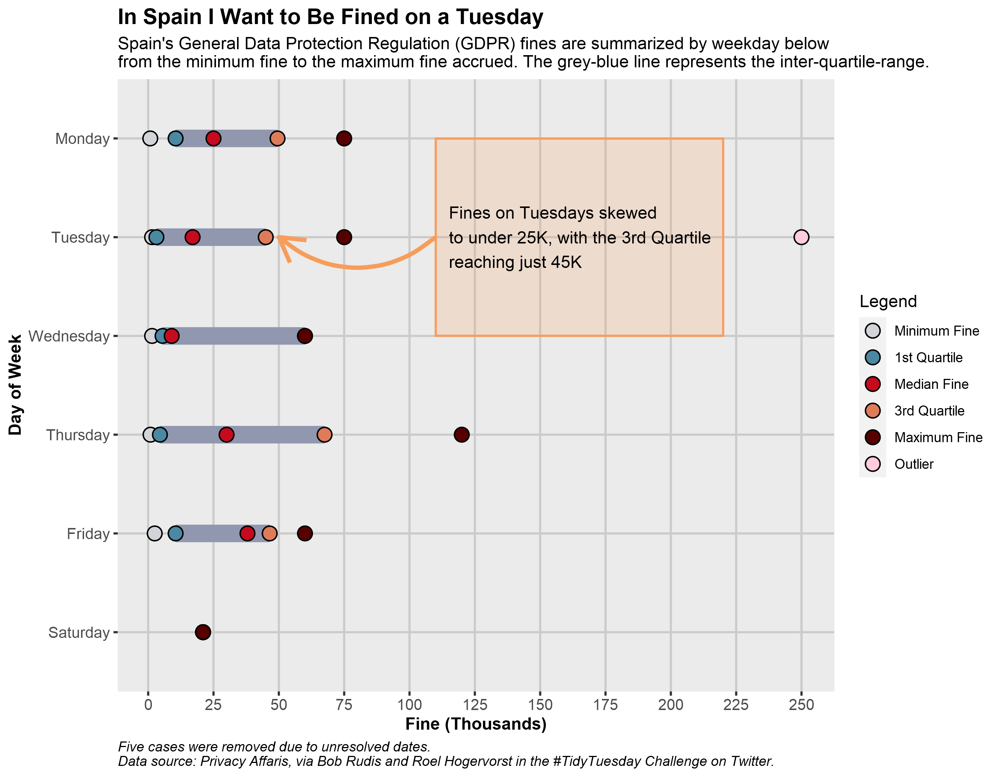

# TidyTuesday Challenges
A repository for my #TidyTuesday challenge submissions, a project created by [R for Data Science](https://www.rfordatasci.com/) that is posted each week on their [TidyTuesday](https://github.com/rfordatascience/tidytuesday) repo. Many thanks to them for this opportunity!

### Completed (Click the image for more information):
---

  

  	
	  
	

